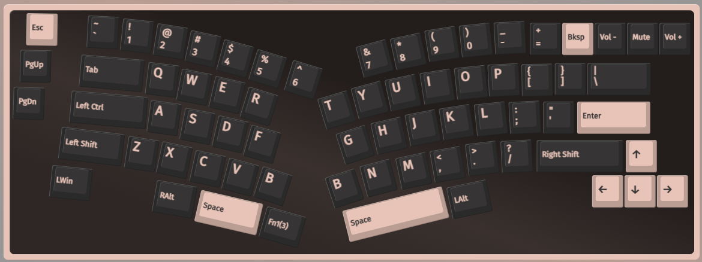
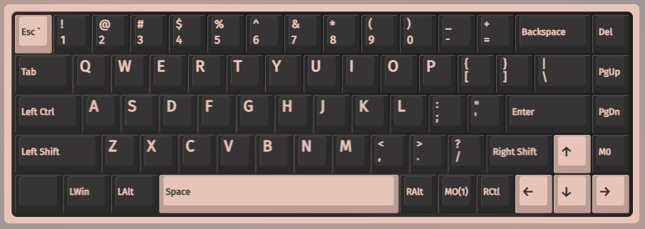
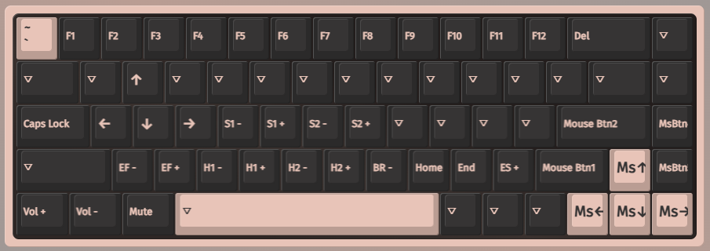

# VIA Keymaps

[VIA App](https://usevia.app/#/)

## CIDOO v68

### Layer 0

- Volume & Mute on Knob

### Layer 1

- F1 - F12 on top row
- Arrow keys on WASD
- Delete on Backspace & Page Down
- Home / End on < / >, respectively

## nk65

### Layer 0

- Macro 0: Ctrl + Shift + M (Mute)

### Layer 1

- Arrows on WASD
- Home/End on </>
- Mouse movement on arrows
- Mouse buttons on cluster around arrows

